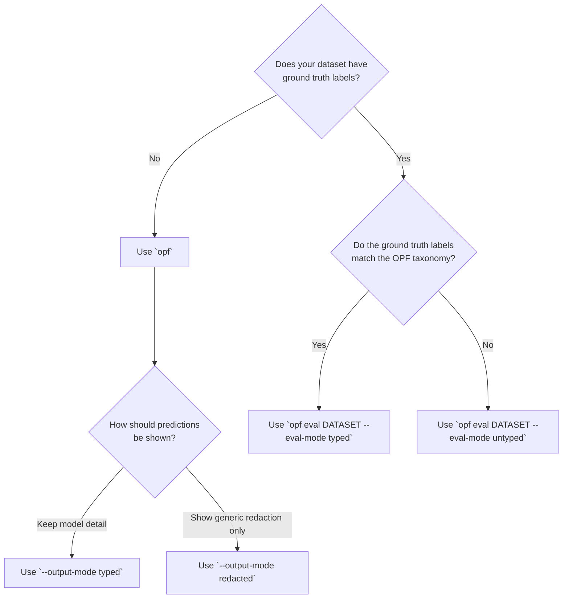

# OPF Evaluation And Output Modes

OPF supports different ways of presenting predictions and running evaluations.

## Core Terms

- `typed`
  - Keep or compare the model's subcategories.
  - In docs, this is the category-level mode.

- `untyped`
  - Ignore category identity during evaluation.
  - In docs, this is the span-level mode.

- `redacted`
  - Collapse all predicted spans into one generic `redacted` label.
  - Use this only for presentation/output, not for gold-label evaluation.

## Decision Flow

| Situation | Use | Mode | Outcome |
| --- | --- | --- | --- |
| No ground truth labels, keep model detail | `opf` | `--output-mode typed` | typed prediction labels |
| No ground truth labels, show generic redaction only | `opf` | `--output-mode redacted` | one generic `redacted` label |
| Ground truth labels match OPF taxonomy | `opf eval` | `--eval-mode typed` | category-level metrics |
| Ground truth labels use a different taxonomy | `opf eval` | `--eval-mode untyped` | span-level matching plus `ground_truth_label_recall` |

1. Does your dataset have ground truth labels?

- No:
  - Use `opf`.
  - Choose how predictions should be shown:
    - `--output-mode typed`
    - `--output-mode redacted`

- Yes:
  - Keep going.

2. Do the ground truth labels match the OPF taxonomy?

- Yes:
  - Use `opf eval DATASET --eval-mode typed`.
  - This is the standard category-level evaluation path.

- No:
  - Use `opf eval DATASET --eval-mode untyped`.
  - This ignores category identity and evaluates span detection only.

## What Each Mode Means In Practice

### `opf`

- `--output-mode typed`
  - Show the model's predicted subcategories such as `private_person` or `private_date`.

- `--output-mode redacted`
  - Collapse all predicted spans to a single label: `redacted`.

### `opf eval`

- `--eval-mode typed`
  - Use when your ground truth labels already use the OPF label set.
  - Reports category-level metrics plus the shared detection metrics.

- `--eval-mode untyped`
  - Use when your ground truth labels use a different taxonomy.
  - Ignores category identity during matching.
  - Hides category-dependent `loss` and `token_accuracy`.
  - Reports:
    - `detection_metrics`
    - `ground_truth_label_recall`

## Why `ground_truth_label_recall` Exists

In `untyped` mode, label names do not need to match the model ontology, but it is still useful to know how well each source label was covered.

`ground_truth_label_recall` answers:

- For each original ground truth label, how much of the ground truth span text was recalled by any predicted span?

This is useful when:

- the dataset has labels like `given name`, `street address`, or other source-specific names
- the model predicts a broader category like `private_person`
- the main question is whether the sensitive region was found, not whether the subtype names align exactly
